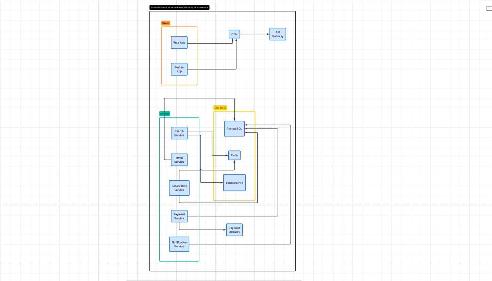
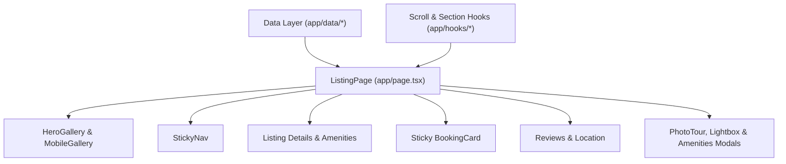

# Airbnb Listing Page — Pixel-Accurate Recreation

A production-ready, pixel-accurate recreation of the reference [Airbnb Listing Experience](https://airbnb-clone-umber-two.vercel.app/), engineered using **Next.js 16 (App Router)**, **React 19**, **TypeScript**, and **Tailwind CSS v4**.

---

## 📌 Table of Contents
1. [Overview](#-overview)
2. [Tech Stack](#-tech-stack)
3. [How to Run](#-how-to-run)
4. [Project Structure](#-project-structure)
5. [AI-Native Development Workflow](#-ai-native-development-workflow)
6. [Fidelity & Interaction Behavior Notes](#-fidelity--interaction-behavior-notes)
7. [System Architecture (`/design`)](#-system-architecture-design)
8. [Master Prompt Specification (`prompt.md`)](#-master-prompt-specification-promptmd)

---

## 🌟 Overview

This project is a high-fidelity implementation of an Airbnb property listing page, reverse-engineered directly from [https://airbnb-clone-umber-two.vercel.app/](https://airbnb-clone-umber-two.vercel.app/). 

Rather than a generic mockup, this codebase strictly adheres to Airbnb's authentic design systems:
- **True 1120px Desktop Container** with restrained geometric typography and strict 8–64px spatial increments.
- **5-Photo Hero Mosaic** with subtle hover zooming and seamless transition to a full-screen categorized **Photo Tour** and **Photo Lightbox**.
- **Interactive Sticky Booking Engine** with dynamic price calculations, inline 2-month calendar range selection, and guest counter popovers.
- **Sticky Navigation Bar** appearing on scroll with smooth scrolling section anchors (`#photos`, `#amenities`, `#reviews`, `#location`).
- **Complete Modal Ecosystem** (Categorized Amenities dialog, Share Sheet, Room Description modal) with deep-linked URL synchronization (`?view=photos`, `?view=amenities`) and keyboard accessibility.

---

## 🛠 Tech Stack

| Layer | Technology |
| :--- | :--- |
| **Framework** | [Next.js 16](https://nextjs.org/) (App Router, Turbopack, Server Components) |
| **Library** | [React 19](https://react.dev/) (Hooks, Suspense, Portals) |
| **Language** | [TypeScript 5](https://www.typescriptlang.org/) (Strict mode, fully typed interfaces) |
| **Styling** | [Tailwind CSS v4](https://tailwindcss.com/) & Native CSS Transitions |
| **Typography** | Geist Sans (clean geometric fallback for Airbnb Cereal) |
| **Icons** | Custom accessible inline SVGs / Lucide icons |
| **State & Navigation** | Browser History API (`pushState`/URL search params) + Custom Scroll Hooks |

---

## 🚀 How to Run

### Prerequisites
- Node.js 18.18+ or 20+
- npm, pnpm, or yarn

### Installation & Development

1. **Clone or navigate to the repository directory:**
   ```bash
   cd airbnb
   ```

2. **Install dependencies:**
   ```bash
   npm install
   ```

3. **Start the local development server:**
   ```bash
   npm run dev
   ```
   Open [http://localhost:3000](http://localhost:3000) in your browser.

4. **Linting and Type Checks:**
   ```bash
   npm run lint
   ```

5. **Production Build & Start:**
   ```bash
   npm run build
   npm run start
   ```

---

## 📂 Project Structure

```text
airbnb/
├── app/
│   ├── components/
│   │   ├── amenities/          # Amenities preview & item rows
│   │   ├── booking/            # Sticky desktop booking card, guest selector, mobile bar
│   │   ├── calendar/           # 2-Month inline date range picker
│   │   ├── footer/             # Site footer & locale/currency controls
│   │   ├── gallery/            # 5-Photo hero mosaic & mobile carousel
│   │   ├── header/             # Site header & search pill
│   │   ├── host/               # Host profile card, badges & bio
│   │   ├── icons/              # Modular SVG icon components
│   │   ├── lightbox/           # Fullscreen keyboard-navigable photo lightbox
│   │   ├── listing/            # Title header, guest favorite badge, sticky nav, rules
│   │   ├── location/           # Location map preview & neighborhood guide
│   │   ├── modals/             # Amenities modal, share sheet, description modal
│   │   ├── photo-tour/         # Fullscreen categorized photo tour modal
│   │   └── recommendations/    # "More stays nearby" card carousel
│   ├── data/                   # Structured mock data & TypeScript models
│   │   ├── amenities.ts        # Grouped amenity listings
│   │   ├── icon-data.ts        # SVG icon paths and definitions
│   │   ├── listing.ts          # Core property details & pricing config
│   │   ├── nearby-stays.ts     # Similar listing recommendations
│   │   ├── photos.ts           # Categorized photo gallery datasets
│   │   ├── reviews.ts          # Ratings breakdown, category scores, reviews
│   │   └── rooms.ts            # Bedroom & sleeping arrangement configurations
│   ├── hooks/
│   │   └── useScrollPosition.ts# Scroll threshold & active section observer
│   ├── globals.css             # Tailwind v4 theme tokens & base styles
│   ├── layout.tsx              # Root HTML layout with Geist font
│   └── page.tsx                # Main listing page orchestrator
├── design/
│   └── architecture.md         # Component diagrams & data flow specs
├── prompt.md                   # 62-point master recreation specification
├── AGENTS.md                   # Agent & Next.js environment guidelines
├── package.json
└── tsconfig.json
```

---

## 🤖 AI-Native Workflow

This repository was constructed using a systematic, **AI-native prompt-driven development cycle**:

```text
[1. Deconstruct Reference] ──► [2. Data Modeling] ──► [3. Core Components]
                                                               │
[6. Pixel QA Validation]   ◄── [5. History & State]  ◄── [4. Interaction Hooks]
```

1. **Deconstruction & Specifications (`prompt.md`)**:
   - The reference website was decomposed into 62 precise criteria covering spatial geometry, layout constraints, color palettes, and component behaviors.
2. **Data-First Architecture (`app/data/`)**:
   - Isolated listing datasets into strongly typed mock data modules to ensure separation of concerns.
3. **Component-Driven Assembly**:
   - Built modular components (`header`, `gallery`, `booking`, `amenities`, `reviews`, `photo-tour`, `lightbox`) from primitive design tokens.
4. **Behavior & State Hooking**:
   - Integrated scroll detection (`useScrollPosition`), active viewport tracking (`useActiveSection`), and body-scroll locking.
5. **URL History Deep Linking**:
   - Synchronized modal states with query parameters (`?view=photos`, `?view=photos&photo=N`, `?view=amenities`) for native browser navigation.
6. **Iterative Visual QA**:
   - Executed pixel-level comparison against reference breakpoints (`1440px`, `1024px`, `768px`, `390px`).

---

## 🎨 Fidelity & Behaviour Notes

- **Max Width & Spacing**:
  - Global centered container capped at `1120px` with `24px` horizontal padding.
  - Spacing strictly follows the scale: `8px` (gaps), `16px` (padding), `24px` (components), `48px` (sections).
- **Color System**:
  - Primary text `#222222`, Secondary text `#717171`, Borders `#DDDDDD`, Page background `#FFFFFF`, Brand accent `#FF385C`.
- **Restrained Motion**:
  - All interactive elements use standard easing `cubic-bezier(0.2, 0, 0, 1)`.
  - Image hover scale is capped at `1.045` within fixed `overflow: hidden` wrappers.
  - Lightbox transitions use smooth 260ms opacity + 24px horizontal offset animations.
- **Keyboard & Overlay Hierarchy**:
  - `Escape` key closes active overlays sequentially: `Lightbox` $\rightarrow$ `Photo Tour` $\rightarrow$ `Listing Page`.
  - Arrow keys (`ArrowLeft`, `ArrowRight`) trigger instantaneous, smooth photo navigation in the lightbox.
  - Body scroll is locked automatically during modal and lightbox visibility.

---

## 📐 System Architecture (`/design`)

The system architecture, component dependencies, and interaction flows are documented in the [`/design`](./design) directory.

### Visual Architecture Diagram


### Architecture Preview & Data Flow
The detailed architecture breakdown and state lifecycle specifications are maintained in [design/architecture.md](file:///c:/Users/mayan/Desktop/hemant/airbnb/design/architecture.md).



For complete diagrams on state synchronization, class hierarchy, and URL flow, see [design/architecture.md](file:///c:/Users/mayan/Desktop/hemant/airbnb/design/architecture.md).

---

## 📋 Master Prompt Specification (`prompt.md`)

The comprehensive 62-point master specification and quality assurance checklist used for this project is maintained in [prompt.md](file:///c:/Users/mayan/Desktop/hemant/airbnb/prompt.md).

It includes detailed guidelines for:
- Core visual and layout priorities
- Photo tour 2-column specifications (~976px width, sticky category headers)
- Sticky reservation card bounds and mathematical breakdown
- Two-month date picker interaction rules
- Complete 62-point Visual QA checklist across mobile, tablet, and desktop breakpoints
