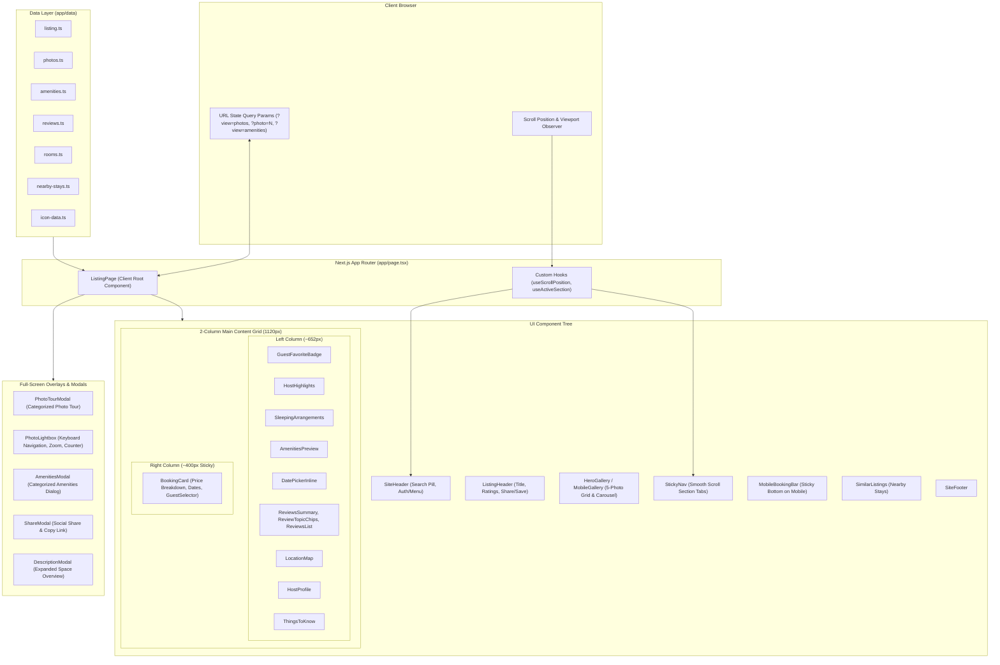
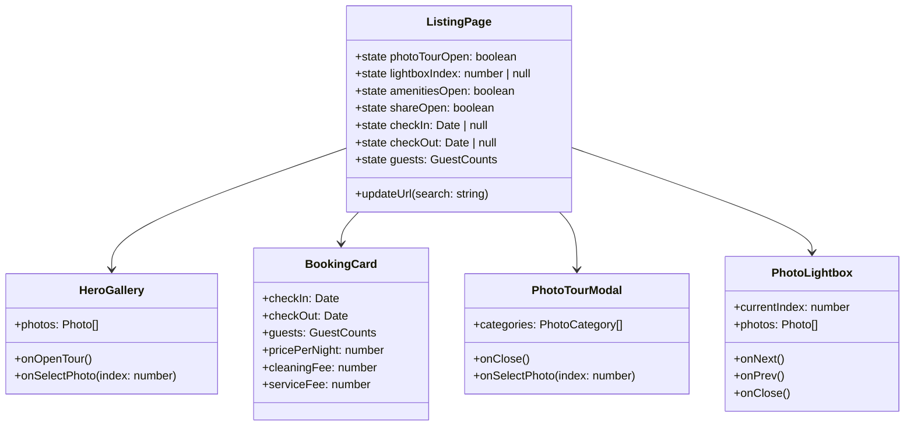
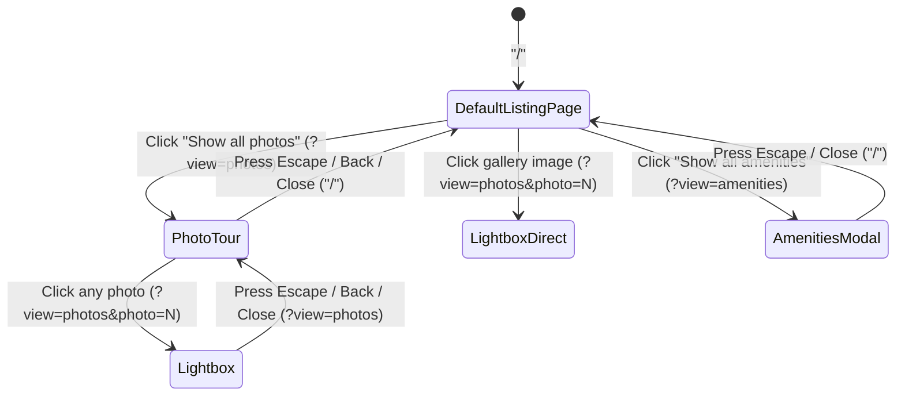

# System Architecture & Component Design

This document details the component hierarchy, data flow, modal state synchronization, and interaction lifecycle for the Airbnb Listing recreation.

---

## 1. High-Level Architecture Diagram

---

## 2. Component Hierarchy & Data Flow

---

## 3. Modal & URL History Flow

